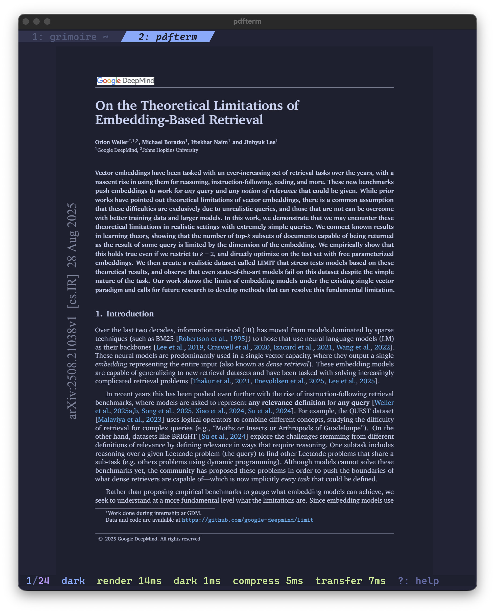

# pdfterm

`pdfterm` is a low-latency PDF viewer for Kitty terminals. It renders on the machine where the command runs, compresses each page once, and sends the bitmap through Kitty's graphics protocol. Direct SSH sessions need no local helper.



The current viewer fits one page to the terminal, keeps the current and adjacent pages in memory, and gives foreground renders priority over prefetch work. It reloads each open document automatically when the PDF changes while preserving that tab's current page. Run it without a path or press `f` to open a fuzzy PDF picker in a new tab; recently opened documents appear at the top and remain searchable alongside recursively discovered PDFs. Picker searches match filenames and parent directories, with filename matches ranked first. Press `/` to filter a picker; `Esc` clears an active query before closing it.

You can fit pages to the terminal width or height and scroll through the overflow, jump around with the outline (table of contents) or a go-to-page prompt, follow annotated links, use Polaris-style dark mode for dark-on-light PDFs, and copy the current page's text to the clipboard (over SSH, via OSC 52). Dark mode uses the selected theme's document colors, preserves document hues, and leaves embedded images unchanged. The status line shows one total render time by default; press `p` to expand it into rendering, dark-mode conversion, compression, and transfer timings.

## Requirements

- Rust 1.85 or newer
- Kitty 0.20 or newer
- macOS arm64, Linux x86_64, or Linux aarch64

tmux support is not included yet. Run `pdfterm` directly under SSH until Kitty graphics passthrough is added.

## Install

```console
cargo install --git https://github.com/jrf/pdfterm.git
```

The build downloads PDFium revision 7881 for the target platform, verifies its SHA-256 checksum, and embeds it in the executable. On first use, `pdfterm` extracts the library to `$XDG_CACHE_HOME/pdfterm` or `~/.cache/pdfterm`.

To build a checkout instead:

```console
cargo build --release
```

## Run

```console
pdfterm
pdfterm document.pdf
```

Use `--pdfium-library PATH` to override the embedded PDFium library, and `--page N` to open at a specific page.

### Keys

| Key | Action |
| --- | --- |
| `j` `l` arrows space `PageDown` | forward — page, or scroll when the page overflows the viewport |
| `k` `h` arrows `Backspace` `PageUp` | backward — page, or scroll when the page overflows |
| `g` / `G` | first / last page |
| `:` | go-to-page prompt (type a number, `Enter` to jump, `Esc` to cancel) |
| `/` | search selectable document text |
| `n` / `N` | next / previous page containing a search match |
| `m` | cycle fit mode: fit-page → fit-width → fit-height |
| `i` | toggle Polaris-style dark mode |
| `p` | toggle detailed render-performance timings |
| `t` | outline / table of contents (fuzzy filter, `Enter` to jump) |
| `T` | choose and preview a theme for the current session |
| `y` | copy the current page's text to the clipboard |
| `Enter` | open the document-wide link browser |
| `L` | enable mouse link mode, highlight annotations, and open the link browser |
| `b` | return to the view before the last followed internal link |
| `f` | open a PDF in a new tab |
| `Tab` / `Shift-Tab` | switch tabs |
| `Alt-1` … `Alt-9` | select a numbered tab directly |
| `?` | open the keybinding help menu |
| `q` | leave link mode when active; otherwise close the current tab |
| `Esc` | leave link mode; otherwise close a pane, clear search, or exit |

In fit-width and fit-height modes, the movement keys scroll within a page that is
larger than the viewport and cross into the adjacent page at the edges. The `h`/`l`
keys and left/right arrows scroll horizontally in fit-height mode.

Search scans and caches selectable text incrementally without blocking foreground
page rendering. Results open beside the PDF, grouped by outline section and page,
with one surrounding-text snippet per matching page. Use `j`/`k`, arrows,
`Ctrl-b`/`Ctrl-f`, or `g`/`G` to navigate, and `Enter` to jump while keeping the
results visible. In a split layout, `h` focuses the PDF and `l` returns to the
results (`Tab` toggles focus); `/` starts a new search and `Esc` closes the pane.
The search is case-insensitive, treats runs of whitespace as a single space, and
highlights matches using the active theme. Image-only PDFs require OCR and are
reported as having no matches.

Mouse link mode temporarily enables mouse capture so normal terminal text selection is
unchanged outside the mode. Press `L` to enable it, highlight annotations, and
open the document-wide link browser automatically. Press `Enter` at any time to
open the same browser without enabling annotation highlighting. It uses a
Grimoire-style split view. Wide terminals place
the PDF on the left and a compact link sidebar on the right; narrow terminals
place the PDF above the links. Links are indexed incrementally behind foreground
page rendering and grouped by document section and source page when the PDF has
an outline, with source-page-only headings as a fallback. The
split repositions Kitty's retained page image without rerendering or retransmitting it.
In the browser, use `j`/`k`, arrows, or type an entry number to preview that
link's source location in the PDF; rapid selection changes are debounced to
avoid redundant rendering. Click a row to select it, or press `Enter` to follow
the selected link. Closing the browser restores the view from before the preview. `Ctrl-f`/`Ctrl-b`
move by a viewport and `g`/`G` select the first or last link. In a split layout,
press `h` to focus the PDF and `l` to return to the link list (`Tab` toggles focus
too); PDF movement keys then navigate the preview without closing the browser.
While link mode is active, press `Esc` or `q` once to close the browser and
disable link mode. Floating layout remains modal. Press `/` to filter
by label, source page, destination page, or URL;
when the browser was opened with `Enter`, `Esc` clears the filter before closing
the picker. Links are ordered by source page,
then top-to-bottom and left-to-right. Wrapped or column-interleaved PDF annotations
that share a destination are reconstructed as one readable entry. The selected-link
panel shows source and destination details plus, when PDF
text extraction permits it, the surrounding citing text and matching numbered reference.
Context is cached during background link indexing, so browser navigation does not
perform additional PDF work. Link history is kept independently for each tab.
External URLs are copied to the local clipboard with OSC 52 instead of being
opened on the remote machine. Set `persistent_link_picker = true` to keep the
split open after following or copying a link; `Esc` closes it. Press `s` to cycle
vertical, horizontal, and floating layouts, or `a` to restore automatic layout
selection. These runtime layout choices are session-only and do not rewrite the
configuration file. Press `L` to leave link mode. Plain citation text without a
PDF link annotation is not inferred.

## Configuration

`pdfterm` reads an optional config file from `$XDG_CONFIG_HOME/pdfterm/config.toml`
(falling back to `~/.config/pdfterm/config.toml`). A missing file uses the defaults;
a malformed file is reported once and ignored. Supported keys:

```toml
# fit-page (default), fit-width, or fit-height
fit_mode = "page"

# enable Polaris-style dark mode by default
dark_mode = true

# keep the link split open after following or copying a link
persistent_link_picker = true

# percentage of the split assigned to the link browser (default 50; range 20-80)
link_picker_split_percent = 50

# auto, vertical, horizontal, or floating
link_picker_layout = "auto"

# load one theme directly and list picker entries explicitly
theme = "~/.config/themes/tokyo-night-moon.toml"
theme_catalog = "~/.config/themes/catalog.toml"
```

`link_picker_layout = "vertical"` keeps the PDF on the left and links on the
right; `"horizontal"` keeps the PDF above the links; and `"floating"` places an
opaque centered browser over the full-size PDF. The default `"auto"` chooses a
split from the terminal shape. `link_picker_split_percent` controls the link pane
in split layouts and is ignored by the floating layout. The legacy `invert` key
remains accepted as an alias for `dark_mode`. `theme` is loaded directly, while
`theme_catalog` supplies an explicit `themes = [...]`
array for the picker. pdfterm never scans a theme directory. Both the shared
`[colors]`/`[ui]` schema and pdfterm's legacy complete-palette schema are accepted. Legacy theme
files contain the complete color palette using `#RRGGBB` values:

```toml
bg = "#222436"
bg_dark = "#1e2030"
bg_dark1 = "#191B29"
bg_highlight = "#2f334d"
blue = "#82aaff"
blue0 = "#3e68d7"
blue1 = "#65bcff"
blue2 = "#0db9d7"
blue5 = "#89ddff"
blue6 = "#b4f9f8"
blue7 = "#394b70"
comment = "#636da6"
cyan = "#86e1fc"
dark3 = "#545c7e"
dark5 = "#737aa2"
fg = "#c8d3f5"
fg_dark = "#828bb8"
fg_gutter = "#3b4261"
green = "#c3e88d"
green1 = "#4fd6be"
green2 = "#41a6b5"
magenta = "#c099ff"
magenta2 = "#ff007c"
orange = "#ff966c"
purple = "#fca7ea"
red = "#ff757f"
red1 = "#c53b53"
teal = "#4fd6be"
terminal_black = "#444a73"
yellow = "#ffc777"

[git]
add = "#b8db87"
change = "#7ca1f2"
delete = "#e26a75"
```

If the selected theme is missing or malformed, pdfterm reports it once and uses
its internal fallback palette. Press `T` to preview and apply any
installed theme for the current session; picker changes do not rewrite
`config.toml`.

Dark mode uses `bg_dark` and `fg` for the document background and foreground by
default. Low-contrast dark-blue text inside PDF link annotations is lifted
toward the document foreground, with the theme's `cyan` as a fallback, so links
remain readable. A theme can override the document background and foreground
independently:

```toml
[document]
background = "#1e2030"
foreground = "#c8d3f5"
```

Recently opened documents are tracked in `$XDG_CACHE_HOME/pdfterm/recent`
(or `~/.cache/pdfterm/recent`) and shown with their parent directories for context.
Filtered picker results are labeled `RECENT`, `HERE`, or `SUBDIR` so their source
remains visible after the recent-files heading is replaced by search results. Use
`j`/`k` or arrows to move, `Ctrl-b`/`Ctrl-f` to move by a page, and, before
entering a filter, `g`/`G` to jump to the first or last result. The file, outline,
theme, link, and search-result pickers use the same navigation conventions.

## Checks

```console
scripts/check-all
```

The checks format, typecheck, lint with warnings denied, test, and build the release binary. Protocol tests use generated byte buffers and never use real PDF content.
