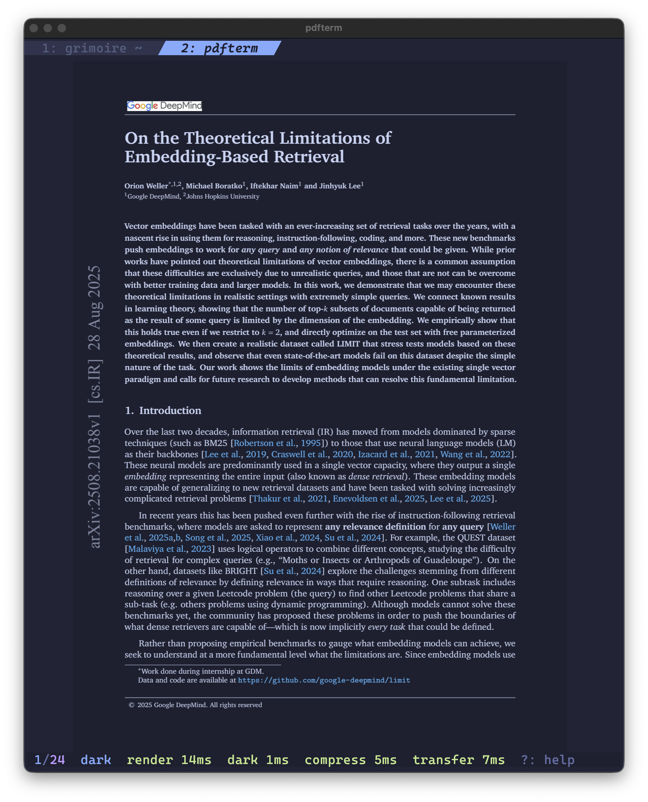

# pdfterm

`pdfterm` is a low-latency PDF viewer for Kitty, Ghostty, and WezTerm. It renders where the command runs, compresses each page once, and sends the bitmap through the Kitty graphics protocol. Direct SSH sessions need no local rendering helper.



The current page is kept when the file reloads. Omit the path, or press `f`, to open another PDF in a new tab.

## Requirements

- Rust 1.88 or newer to build
- Kitty 0.20+, Ghostty, or WezTerm with Kitty graphics support
- macOS arm64, Linux x86_64, or Linux aarch64

Run directly in the terminal; tmux graphics passthrough is not supported.

## Install

```console
cargo install --locked --git https://github.com/jrf/pdfterm.git
```

PDFium revision 7881 is checksummed and embedded. From a checkout, `cargo build --release`.

## Run

```console
pdfterm document.pdf
```

## Keys

Press `?` for the full list in the viewer.

| Key | Action |
| --- | --- |
| `j` `k` `↑` `↓` | Scroll vertically across pages |
| `h` `l` `←` `→` | Scroll horizontally, then change page |
| `Space` `PageDown` / `Backspace` `PageUp` | Page the viewport |
| `g` / `G` | First / last page |
| `:` | Go to a page |
| `/` | Search text, or filter the open list |
| `n` / `N` | Next / previous page with a match |
| `m` | Cycle fit: page, width, height |
| `+` / `-` | Zoom by 25% (up to 400%) |
| `0` | Reset zoom |
| `i` | Polaris-style dark mode |
| `p` | Render timings |
| `t` / `T` | Outline / theme for this session |
| `y` | Copy this page's text (OSC 52) |
| `Enter` / `L` | Link list / link list with highlights |
| `b` | Back from the last internal link |
| `f` | New tab |
| `Tab` / `Shift-Tab` | Next / previous tab |
| `Alt-1` … `Alt-9` | Jump to a tab |
| `x` / `Alt`/`Option` + click | PDF-to-source navigation |
| `q` | Leave link mode, or close the tab |
| `Esc` | Leave link mode, close a pane, clear a filter, or exit |

## Configuration

`$XDG_CONFIG_HOME/pdfterm/config.toml`, or `~/.config/pdfterm/config.toml`. First launch creates defaults; invalid configuration stops startup. See [config.default.toml](config.default.toml) for settings.

## Neovim

The bundled plugin works with [Lazy.nvim](https://github.com/folke/lazy.nvim); install the viewer separately:

```lua
{
  "jrf/pdfterm",
  main = "pdfterm",
  lazy = false,
  opts = { executable = "pdfterm", open_pdf = true },
}
```

`:PdfTermOpen` opens a PDF. `:PdfTermForwardSplit` opens/navigates the viewer beside Neovim; `:PdfTermForward` navigates an existing viewer.

Kitty splits require `allow_remote_control yes`; detached Neovim also needs a private `listen_on` socket. Ghostty control is macOS-only. WezTerm requires `wezterm` on `PATH`. For manual pairing, use `:PdfTermViewerCommand`.

## SyncTeX

LaTeX navigation requires `synctex` on `PATH` and a matching `.synctex.gz` sidecar:

```console
latexmk -pdf -synctex=1 main.tex
```

Forward search uses the source cursor; `Alt`/`Option` + click or `x` navigates from PDF text back to its source. Neither direction changes terminal focus by default.
